# CoWatch Four-APK Flavor Architecture

Last updated: 2026-07-26

This report describes the current source tree. Source code is the authority when an older design note conflicts with this document.

## 1. Current Gradle and source-set structure

The repository contains one Android application module:

- `:app`: one application module producing four independently installable APKs.

```text
app/src/
  main/
    AndroidManifest.xml
    aidl/com/ivi/common/ipc/
    assets/fileVideoSample/
    assets/seekPreview/
    java/com/ivi/app/IVIApplication.kt
    java/com/ivi/common/
    res/

  cid/
    AndroidManifest.xml
    java/com/ivi/cid/

  pid/
    AndroidManifest.xml
    java/com/ivi/pid/

  rear/
    AndroidManifest.xml
    java/com/ivi/rear/
```

`rearLeft` and `rearRight` both compile `app/src/rear/java` and the same Rear manifest. Their identity is supplied by flavor-specific `BuildConfig.SCREEN_ROLE`.

Available application variants are:

- `cidDebug`, `cidRelease`
- `pidDebug`, `pidRelease`
- `rearLeftDebug`, `rearLeftRelease`
- `rearRightDebug`, `rearRightRelease`

## 2. APK identity and role ownership

| APK | Application ID | Source owner | Runtime role |
|---|---|---|---|
| CID | `com.hieuld.cowatch.cid` | `com.ivi.cid` | Independent CID host |
| PID | `com.hieuld.cowatch.pid` | `com.ivi.pid` | Broadcast authority and fanout owner |
| Rear Left | `com.hieuld.cowatch.rear.left` | `com.ivi.rear` | `REAR_LEFT` |
| Rear Right | `com.hieuld.cowatch.rear.right` | `com.ivi.rear` | `REAR_RIGHT` |

All four APKs use the shared `ico_general_media_s` application icon, `@string/app_name` launcher label and shared resources. The Rear APKs remain distinct through package ID and runtime role without duplicating Kotlin implementation.

## 3. `app/src/main` ownership

`com.ivi.common` owns code and assets reused by all APKs:

- `AssetVideo`, `VideoSource`, repository and playback contracts.
- Recursive asset catalog discovery under `assets/fileVideoSample`.
- Seven shared demo videos.
- Thumbnail loading, persistent cache and background rendering.
- `Media3PlaybackController`, one stable process-level ExoPlayer/MediaSession owner per APK process.
- Player/Surface attachment contracts and Media3 helper functions.
- Shared PID-style horizontal library used by PID and both Rear APKs.
- Shared playback-control bar, timeline, seek handle and transport layout.
- Shared press/release button animation and icon-scoped click behavior.
- Shared in-app PiP shell.
- Shared focused-video interaction policy: selecting a card never starts playback.
- Shared storyboard seek-preview provider and decoder.
- Parcelable protocol models and AIDL interfaces for PID/Rear communication.

Assets, resources, AIDL contracts and common Kotlin code exist once in `app/src/main`; Android compiles them into every application flavor.

## 4. Flavor ownership

### 4.1 CID

`com.ivi.cid` owns:

- Vertical library rail and CID-specific layout.
- CID navigation, library/player activities and ViewModels.
- `CIDPlayerSurface`, which moves the common player between Media3 `PlayerView` surfaces.
- Direct fullscreen-to-library-PiP behavior.

CID has no PID, Rear, AIDL sharing or EGL fanout dependency.

### 4.2 PID

`com.ivi.pid` owns:

- PID library/player activities and ViewModels.
- Broadcast control, target-selection dialog and host notifications.
- `PidPlaybackShareService`, protected by the signature permission.
- `PidShareCoordinator`, the serialized sharing state machine.
- `PidRenderFanout` and `FrameFanoutRenderEngine`.
- Rear target state derived from live receiver registration.

PID is the only playback authority during a shared session.

### 4.3 Rear Left and Rear Right

`com.ivi.rear` owns one implementation compiled into two APKs:

- Standalone horizontal library and local Media3 playback.
- `RearShareClient`, which binds to the PID coordinator.
- Receiver accept/dismiss dialog and ten-second auto-accept countdown.
- Shared-session Surface registration.
- Read-only shared player UI and local playback restoration.
- Runtime role from `BuildConfig.SCREEN_ROLE`.

The two Rear processes remain independent outside sharing.

## 5. Playback and rendering topology

### 5.1 Standalone mode

Each running APK owns its own stable `Media3PlaybackController`, ExoPlayer and MediaSession. `stop()` clears media and decoder resources but intentionally keeps the process-level player/session object stable. Final process teardown is available through `releaseProcessResources()`.

CID uses `PlayerView` switching. PID uses the fanout input even for its host and library-PiP outputs. Rear uses `PlayerView` for local playback.

### 5.2 PID shared mode

```text
PID ExoPlayer / one decoded video stream
                |
                v
      SurfaceTexture input Surface
                |
                v
     FrameFanoutRenderEngine (EGL/GLES)
        |             |              |
        v             v              v
    PID host     Rear Left Surface  Rear Right Surface
```

When a Rear accepts sharing:

1. Rear captures its local source, position, play state, speed and destination.
2. Rear stops and clears local media/codec resources.
3. Rear opens its shared player and registers a Binder-parceled `Surface` with PID.
4. PID renders the same decoded frame into each accepted output.
5. Rear displays a passive control bar driven by PID snapshots.
6. When sharing ends, Rear restores `FULLSCREEN`, `LIBRARY_PIP` or `LIBRARY_IDLE` as appropriate.

Remote Binder surfaces are owned and released by the PID renderer when removed. Local PID host/PiP surfaces remain owned by their Compose `SurfaceView` lifecycle.

## 6. Shared playback UI contract

### Buttons

- Speed, previous, next, play/pause, expand/collapse and close reuse common components.
- Normal and pressed artwork crossfades without replacing the clickable node.
- Press-and-hold displays the pressed state.
- Release inside executes once; release outside cancels.
- Touch regions are icon-sized even when the layout slot/background is larger.
- The Play button is anchored to the absolute center of the transport area.
- Left and right control groups use 124dp slots, so adding the PID broadcast button does not move Play.
- PID broadcast is the only PID-owned control in the common transport layout.

### Control bar and timeline

- The total layout height is 154dp.
- The original 134dp control-bar background is bottom-aligned.
- The full-width timeline is a sibling above the background at `zIndex(10f)`.
- The 40dp seek handle is centered on the progress line and uses `img_general_slider_handle_n`.
- The seek touch strip is 16dp high.
- Interactive host controls auto-hide after five idle seconds and reappear on a screen tap.
- During a seek drag, playback pauses, the bar remains visible and playback resumes only if it was playing before the drag.

### Shared Rear overlay

- The Rear shared overlay uses the same title, timeline, transport geometry and background as PID.
- Transport buttons are permanently rendered with pressed artwork and are disabled.
- A Rear screen tap changes only that screen's overlay visibility.
- Each Rear screen owns an independent five-second auto-hide timer.
- Progress advances only when the PID snapshot reports `isPlaying=true`.

### Focused video

- Clicking or dragging to a side card changes focus only.
- Clicking an already-focused card does not start playback.
- Only the focused card's Play button starts a new video.
- If that video already owns the active session, Play toggles the existing session.

### In-app PiP

- CID, PID and Rear reuse the same PiP chrome and icon-only controls.
- CID and Rear switch the player between `PlayerView` surfaces.
- PID attaches/removes a dedicated fanout output by Surface generation.
- Returning to fullscreen for the same source preserves decoder, playback position and state.

## 7. Seek-frame generation and lookup

- Videos are stored under `app/src/main/assets/fileVideoSample`.
- Storyboards are stored under `app/src/main/assets/seekPreview`.
- Each of the seven videos currently has a storyboard directory and `index.txt`.
- `tools/generate_seek_previews.ps1` generates build-time frames with FFmpeg.
- `:app:preBuild` depends on `generateSeekPreviews`.
- Gradle inputs/outputs prevent unchanged assets from being regenerated.
- Runtime seeking reads the prebuilt storyboard; it does not decode preview frames from the playing stream.

## 8. PID/Rear IPC protocol

The current protocol version is `4`.

- PID exports `PidPlaybackShareService` with `com.hieuld.cowatch.permission.SHARE_PLAYBACK`.
- The permission has `signature` protection.
- Rear registers `role`, actual Activity `displayId`, protocol version and ready state. The
  current PID implementation accepts that registration only when the reported display ID matches
  the fixed vehicle mapping in section 12.
- PID sends request, scheduled-start and reconciliation snapshots.
- Snapshots contain source, position, duration, anchor time, `playWhenReady`, actual `isPlaying`, speed, scheduled start, seek event and sequence.
- Surface registration includes `sessionId` and monotonically increasing `surfaceGeneration`.
- Shared snapshots, receiver status and render-surface registration validate their session ID;
  stale Surface generations are rejected. `requestLeaveSharing(role, sessionId)` currently does
  not validate the supplied `sessionId` before stopping that role, so it is not covered by this
  guarantee.
- Binder death handling checks Binder identity so an old callback cannot remove a newer receiver registration.

The sharing state machine is:

```text
WAITING_RECEIVERS
        -> WAITING_RESPONSES
        -> WAITING_SURFACES
        -> SHARING
        -> finished
```

### End-to-end broadcast workflow

```mermaid
flowchart TD
    A["PID has a selected video"] --> B["User taps Broadcast"]
    B --> C{"Configured Rear display is available and on?<br/>Left = 2, Right = 3"}
    C -- "No" --> C1["Keep PID state; show no-rear-screen message"]
    C -- "Yes" --> D["Remember wasPlaying; pause PID; show target dialog"]

    D --> E{"Dialog cancelled or dismissed?"}
    E -- "Yes" --> E1["Resume PID only when wasPlaying = true"]
    E -- "No; selected roles submitted" --> F{"At least one role is still selectable?"}
    F -- "No" --> F1["Share start fails; resume PID only when wasPlaying = true"]
    F -- "Yes" --> G["Create sessionId and capture PID anchor position"]

    G --> H{"Each selected Rear is registered READY<br/>on its configured display?"}
    H -- "No" --> H1["PID cold-launches ReceiverConsentActivity<br/>on configured display"]
    H1 --> H2{"READY within 8 seconds?"}
    H2 -- "No" --> H3["Mark role failed and remove it from session"]
    H2 -- "Yes" --> I["Send share request to every READY role"]
    H -- "Yes" --> I
    H3 --> I0{"Any READY role remains?"}
    I0 -- "No" --> Z1["Finish before SHARING;<br/>resume PID only when wasPlaying = true"]
    I0 -- "Yes" --> I

    I --> J{"Rear response within 12 seconds?"}
    J -- "Dismiss or timeout" --> J1["Leave that Rear local; remove role"]
    J -- "Accept or auto-accept after 10 seconds" --> K["Rear saves local state; releases local media;<br/>sets shared mode and opens shared player"]
    J1 --> J2{"Any accepted role remains?"}
    J2 -- "No" --> Z1
    J2 -- "Yes" --> L
    K --> L["Rear SurfaceView registers<br/>sessionId + surface generation"]

    L --> M{"PID EGL fanout attaches Surface<br/>within 5 seconds?"}
    M -- "No" --> M1["Remove failed role and send stop callback"]
    M -- "Yes" --> N["All ready roles receive scheduled snapshot"]
    M1 --> M2{"Any Surface-ready role remains?"}
    M2 -- "No" --> Z1
    M2 -- "Yes" --> N

    N --> O["Set scheduled start = now + 700 ms"]
    O --> P["PID seeks to anchor and resumes only if wasPlaying"]
    P --> Q["SHARING: one PID decoder fans out to PID and accepted Rear surfaces"]
    Q --> R["Publish player-event snapshots and reconcile every 2 seconds"]

    R --> S{"Runtime event"}
    S -- "PID play, pause, seek, or speed" --> R
    S -- "Rear Surface recreated within 2 seconds" --> L
    S -- "Rear leaves; Binder dies; or Surface stays lost" --> T["Remove only that Rear output"]
    T --> U{"Another shared Rear remains?"}
    U -- "Yes" --> R
    U -- "No" --> Z2["End active session; Rear restores its saved local destination"]
    S -- "PID Broadcast off, player close, or media replacement" --> Z2
    S -- "PID service/process disconnect" --> Z3["Rear clears shared mode and restores local playback"]
```



Current timing constants:

| Operation | Timeout/interval |
|---|---:|
| Receiver ready | 8 seconds |
| Receiver response | 12 seconds |
| Rear Surface ready | 5 seconds |
| Surface recovery grace | 2 seconds |
| Scheduled start lead | 700 milliseconds |
| Snapshot reconciliation | 2 seconds |
| Rear automatic acceptance | 10 seconds |
| Control auto-hide | 5 seconds |
| PID host notification | 2 seconds |

Coordinator callbacks are posted to `Dispatchers.Main.immediate`. The public UI entry points are
currently called from the main thread and must remain so; there is no separate synchronization
boundary around direct `startSharing()` / `stopSharingAll()` calls.

## 9. Session completion and recovery

One idempotent PID completion path is used for denial, timeout, target departure, host stop and replacement by a new session.

- Jobs and Surface recovery timers are cancelled.
- Remote outputs are removed and owned Surface references are released.
- Receiver targets retained by the final session cleanup return to `READY` or `NOT_RUNNING`.
  A role denied or failed before it was retained can keep its `DENIED` or `FAILED` diagnostic
  state until the next `refreshTargets()` call.
- If sharing never reached `SHARING`, a previously playing PID resumes.
- If sharing was active, normal player state remains authoritative.
- Rear restores its saved local playback destination when PID stops or disconnects.
- User-initiated close from a shared Rear screen returns that Rear to the library, using PiP when a local source existed.
- On PID service/process disconnect, a Rear clears shared mode and restores its saved local
  destination. It does not schedule a new bind automatically; it registers again when its
  Activity next supplies/refreshes the display.

## 10. Hilt composition

- `IVIApplication` in `app/src/main` is the single `@HiltAndroidApp` application class.
- The application module enables Hilt aggregation and AGP-compatible legacy KAPT.
- Shared catalog, thumbnail, seek-frame and playback objects are application-scoped.
- CID, PID and Rear activities use `@AndroidEntryPoint`.
- Flavor ViewModels use `@HiltViewModel` and constructor injection.
- PID coordinator/fanout and Rear client are application-scoped singletons within their own processes.

## 11. Boundaries that must remain separate

| CID | PID | Rear | Reason |
|---|---|---|---|
| Vertical rail | Horizontal rail | Shared horizontal rail | Layout requirements differ |
| Direct PlayerView | EGL fanout authority | Local PlayerView or remote Surface | Rendering topology differs |
| No sharing | Coordinator/service | Receiver/client | IPC roles differ |
| CID navigation | PID navigation/dialog | Rear navigation/dialog | APK lifecycle differs |

No flavor package may import another flavor package. Every flavor may import `com.ivi.common`.

## 12. Current display mapping and cold launch

`BuildConfig.SCREEN_ROLE` distinguishes the two Rear APKs, but the current PID source also
enforces a fixed vehicle display layout:

```text
REAR_LEFT  -> displayId 2
REAR_RIGHT -> displayId 3
```

`RearDisplayResolver` exposes a target only when that fixed display exists, is valid and is on.
`PidShareCoordinator` rejects a registration whose actual Activity display ID does not equal the
configured ID. The Rear's registered display ID is therefore a validation value, not the source
of the PID mapping.

When a target is selectable but its Rear app is not registered, PID uses `RearAppLauncher` to
start the role-specific exported `ReceiverConsentActivity` on the configured display via
`ActivityOptions.setLaunchDisplayId()`. The launch succeeds only if the OEM/AAOS display policy
allows that package/activity on the target display. PID then waits up to eight seconds for the
Rear to register ready.

Consequently, a device that enumerates Rear displays with IDs other than `2` and `3` is not
supported by the current source. Supporting dynamic display IDs requires a source change; it is
not a current runtime capability.

## 13. Verification status

Source/static verification represented by this report on 2026-07-26:

- `settings.gradle.kts` includes only `:app`.
- Four application flavors and their package suffixes are present.
- Rear Left and Rear Right reuse one Rear source set.
- Seven video assets and seven corresponding seek-preview directories are present.
- AIDL protocol, signature permission, fanout renderer, fixed Rear mapping (`2` / `3`) and
  cold-launch helper are wired in current source.
- No compilation, APK assembly, installation or automated test was run for this review. A prior
  compile result must not be treated as verification of the current live worktree.
- Basic playback-control functions on all APKs are user-reported device-PASS baseline evidence;
  they are not re-verified by this source review.

Full remaining real-device coverage is defined in `COWATCH_REAL_DEVICE_MANUAL_TEST_PLAN.md`.

## 14. Current source limitations requiring explicit acceptance

- The manual plan's dynamic-ID cases (`DSP-04`, `DSP-05`, `DSP-09`) conflict with the fixed
  `2`/`3` implementation and must not be used to accept this source as dynamic-mapping capable.
- A stale `requestLeaveSharing()` call for the same role can stop the active target because the
  PID service forwards the role but not the supplied session ID to coordinator validation.
- After PID dies, Rear restores local playback but does not independently retry service binding.
  A foreground/recreated Rear Activity performs the next registration attempt.
- Renderer correctness, one-decoder behavior, cross-display launch permission, black-frame
  recovery and synchronization timing remain real-device assertions. They cannot be proven by
  this report or source inspection alone.
