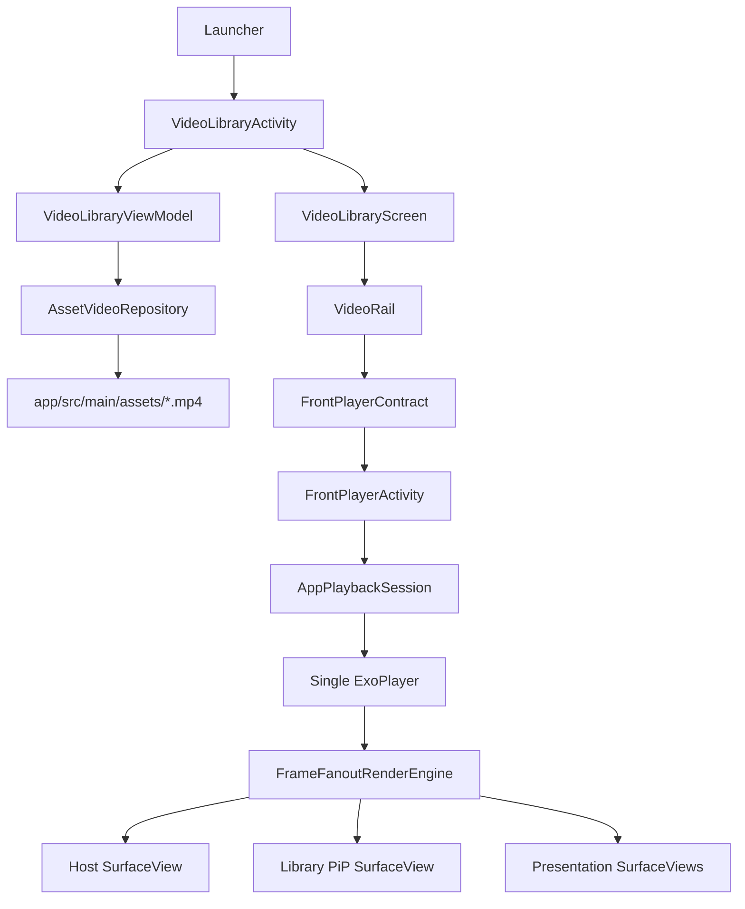
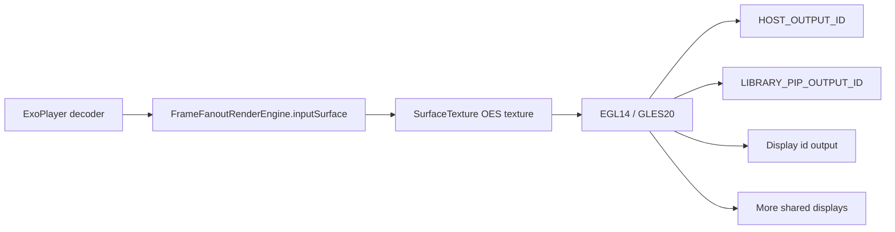

# CoWatch Architecture and Technology Report

## 1. Scope

CoWatch is a local Android Automotive exhibition player. It is designed for one host playback session, an in-app library, app-scoped PiP, and local shared display output through Android `Presentation` windows.

The current implementation stays Kotlin + Jetpack Compose. It intentionally does not use XML UI or dependency injection.

Out of scope by current design:

- System PiP API
- Background playback after the app session is stopped
- MediaSession / MediaLibraryService / Android Auto browser integration
- Remote network receivers
- Independent rear-seat players
- Per-seat audio zone routing

The production exhibition assumption is that media is bundled with the APK and selected inside the app. Current media is stored under:

```text
app/src/main/assets/
```

This makes each video addressable by stable asset path instead of generated `R.raw` ids.

## 2. Current Flow



## 3. Package Ownership

| Package | Responsibility |
|---|---|
| `domain/media` | Stable media identity: `AssetVideo`, `VideoSource.Asset`. |
| `data/media/repository` | Asset catalog scanning. |
| `data/media/provider` | Thumbnail extraction and thumbnail cache. |
| `data/provider` | Provider boundaries such as driving restriction state. |
| `domain/sharing` | Share-session state model. |
| `ext` | Media3 extension helpers adapted from the reference app's playback-state utilities. |
| `session` | Long-lived app playback/share controllers. |
| `render` | One decoded video frame fanout to local surfaces. |
| `display/presentation` | Android `Presentation` windows for external displays. |
| `ui` | Activity shell and navigation contract. |
| `ui/library` | Library screen, rail, thumbnails, in-app PiP surface. |
| `ui/player` | Fullscreen player surface, controls, seekbar, share dialog. |
| `util` | Small reusable helpers currently used by the app: file type checks and time formatting. |
| `viewmodel` | Activity-facing UI state owners. |

The intended dependency direction is:

```text
ui -> viewmodel -> session/data/domain
session -> render/display/domain
data -> domain
ext/util -> framework only
```

The render engine remains a first-class package because it is performance-critical infrastructure, not a UI helper.

## 3.1 Reference App Reuse

The inspected reference app under `D:\A.discere\Mobile\media` is used as an architecture reference, not a direct import.

Reused now:

- Small playback helper pattern: adapted from `PlaybackStateExt` into Media3 `Player` extensions.
- Small utility pattern: time formatting and media file extension checks.
- Provider boundary pattern: `DrivingRestrictionProvider` exists without pulling `android.car` APIs into the build yet.

Deferred:

- `MediaService`
- `MediaLibrary`
- `MediaDatabaseHelper`
- Preference persistence helpers
- Binder-safe bitmap payload compression

These may be required for AAOS system media integration later, but they are intentionally not active in the current local exhibition player. Adding them now would introduce MediaBrowser/MediaSession lifecycle cost before the product requires it.

## 4. Asset Media Model

`AssetVideo` is the library item model:

- `assetPath`: stable path inside APK assets, used as identity and cache key.
- `fileName`: original asset file name.
- `title`: display title derived from the file name.

`AssetVideoRepository` scans `AssetManager` recursively and accepts:

- `.mp4`
- `.m4v`
- `.webm`
- `.mkv`

The repository follows the reference app's catalog lesson:

```text
scan asset paths -> normalize scanned media item -> filter video type -> expose AssetVideo
```

This keeps raw asset traversal out of the ViewModel and Compose UI. The UI only receives stable `AssetVideo` items.

`VideoSource.Asset` converts the selected asset into a Media3 item using:

```text
asset:///path/to/video.mp4
```

Why assets instead of `res/raw`:

- Asset paths are stable and human-readable.
- The app can list files by folder/path.
- Thumbnails can be decoded through `AssetManager.openFd(...)`.
- The code no longer depends on generated resource ids.

Important limitation: assets are still packaged inside the APK. If a future third-party thumbnail library requires a real filesystem path, add a copy-to-cache provider and pass that copied file path.

## 5. Thumbnail Strategy

`AssetVideoThumbnailCache` extracts video frames through `MediaMetadataRetriever` and `AssetFileDescriptor`.

Profiles:

| Profile | Resolution | Use |
|---|---:|---|
| `Rail` | 640x360 | Carousel cards. |
| `Background` | 640x360 | Settled library background. |

Both profiles intentionally stay at 16:9 and 640x360. This limits decode time, GPU upload cost, and memory bandwidth on automotive SoCs such as Telechips Dolphin 5.

Approximate ARGB memory cost:

| Size | Cost |
|---|---:|
| 640x360 | 0.9 MB |
| 1280x720 | 3.5 MB |
| 1920x1080 | 7.9 MB |

Current policy:

- Decode thumbnails serially to reduce startup spikes.
- Cache by `assetPath + profile size`.
- Use committed focus for background updates.
- Do not decode large backgrounds continuously during rail drag.

## 6. Playback Session

`AppPlaybackSession` owns:

- one `ExoPlayer`
- one shared `FrameFanoutRenderEngine`
- current `VideoSource.Asset`
- in-app PiP state

This protects playback during transitions:

- fullscreen player -> library PiP
- library PiP -> fullscreen player
- fullscreen player with shared displays -> library PiP

The player is stopped only when the app explicitly ends playback, not when switching between fullscreen and app-scoped PiP.

## 7. Render Pipeline



The render engine receives one decoded frame stream and draws it to every registered output. This avoids multiple decoders for shared displays.

Output id policy:

- `HOST_OUTPUT_ID`: fullscreen host surface.
- `LIBRARY_PIP_OUTPUT_ID`: in-app library PiP surface.
- real display ids: external presentation surfaces.

Fullscreen and PiP use different output ids so a destroyed fullscreen `SurfaceView` cannot remove the library PiP output.

`fitViewport()` preserves the video aspect ratio per surface. It uses black padding when the output surface aspect ratio differs from the video aspect ratio.

## 8. Shared Display Session

`ShareSessionController` owns the share session.

Share startup:

1. User opens share target dialog.
2. Host pauses at the current anchor position.
3. Selected displays create `Presentation` windows.
4. Each presentation registers a `SurfaceView` output with the render engine.
5. A display is considered ready only after EGL output creation succeeds.
6. When all displays are ready, host seeks to the anchor position and starts playback.

This is frame fanout from one decoder, not independent receiver synchronization.

## 9. UI Sizing and Resolution Rules

Library:

- Rail card aspect ratio is 16:9.
- Focused rail card is 1.5x the side-card width.
- Rail thumbnails are 640x360.
- Library PiP is sized to the focused rail-card dimensions.
- Library PiP is top-right with `top = 56.dp` and `end = 28.dp`.

Player:

- Host video surface is full-screen.
- Close button is top-right, `64.dp` hit target.
- Playback control bar is `118.dp` high.
- Seekbar canvas is `48.dp` high.
- Seekbar stroke is `6.dp`; thumb radius is `12.dp`.
- Transport icons use original drawable colors with no tint.

Shared display:

- Presentation video surface fills the whole external display.
- Shared-display close button is top-right with a `64.dp` hit target and `12.dp` margins.

## 10. Color Rules

Library colors are centralized in `LibraryColors.kt`.

- `ExplorerSurfaceColor`: page/base surface.
- `ExplorerPlaceholderColor`: placeholder image background.
- `RailBackgroundColor`: translucent rail band.
- `ExplorerTitleColor`: title text on dark media background.

Player controls use a dark bottom gradient to preserve video readability under the controls. Media control drawable assets are displayed as original images, not tinted Compose icons.

## 11. Production Notes

For long-running exhibition devices:

- Keep one decoder.
- Keep thumbnails lightweight.
- Do not start PiP during share preparation.
- Keep render output add/remove lifecycle explicit.
- Profile on real target hardware before raising thumbnail resolution.
- Treat display ids as dynamic.
- Treat `Presentation` surface creation as asynchronous and fallible.
- Keep AAOS `MediaService` integration out of the runtime until system media-center/browser support is required.

## 12. Review Checklist

- [x] Media migrated from `res/raw` to `assets`.
- [x] Kotlin source no longer depends on `R.raw` or `resId`.
- [x] Player contract passes `assetPath`.
- [x] Media3 plays `asset:///...` sources.
- [x] Thumbnail extraction reads assets through `openFd`.
- [x] Library UI uses `assetPath` as stable key.
- [x] Library activity delegates state to `VideoLibraryViewModel`.
- [x] One `ExoPlayer` is shared across fullscreen and app-scoped PiP.
- [x] One render engine fans out frames to host, PiP, and shared displays.
- [x] PiP and fullscreen surfaces use separate output ids.
- [x] Shared displays are passive render outputs.
- [x] No MediaSession or background service is required for the current exhibition scope.
- [x] Compose remains the UI stack; no XML UI rewrite is active.
- [x] No dependency injection framework is used.
- [x] AAOS MediaService/MediaLibrary/MediaDatabaseHelper path is documented but deferred.
- [x] Asset scanning is normalized before the library UI receives display items.
